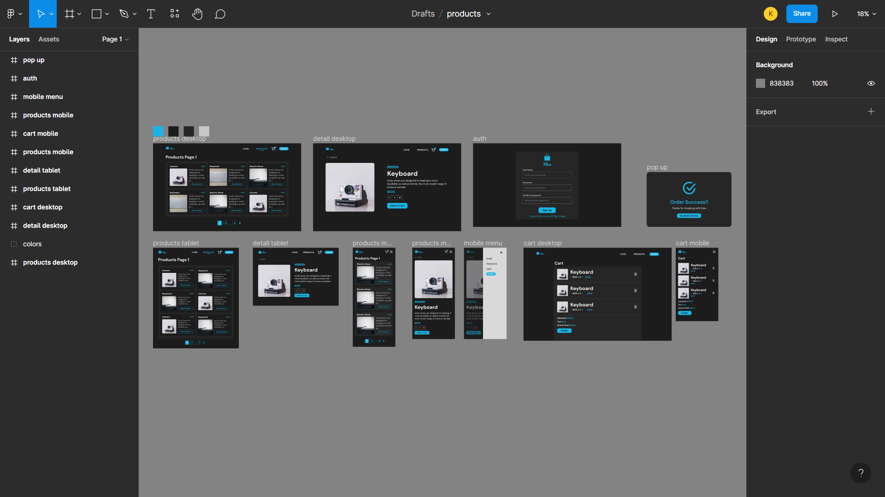

<h1 style='font-weight: bold'>Hive Store</h1>

<a href='https://hive-store.netlify.app'>Live demo</a>
 

## **Built with**

- React
- Context API
- TypeScript
- CSS mobile-first

I chose React instead of Nextjs for this project because users can't access the products page without being authenticated anyway so I didn't see the point in having server-side rendering.

To be honest, I knew nothing about TypeScript before this (even though I added it in my portfolio) but I was about to learn it right after finishing my portfolio. I had to learn it in 2 days for this project so it might be a bit of a mess.

I used plain CSS for styling because I love styling from scratch with CSS.

## **Authentication and Cart**

For user authentication, I chose the easy approach by storing the token in `localStorage`. Same for the cart items but the items are lost when the user switch accounts since the products in different accounts might differ according to the API.

## **Design**

I chose a darker theme with a cyan-blue color for the accent color. I kept the design neat for both mobile and desktop. I did improvise a bit, for example, since we will only have 4 pages, I chose to build a more simpler paginator than the one in the design which would be a lot more work.

## 🛠 **Installation and Setup Instructions**

1. Installation: `npm install`

2. In the project directory, you can run: `npm start`

Runs the app in the development mode.\
Open [http://localhost:3000](http://localhost:3000) to view it in the browser.
The page will reload if you make edits.